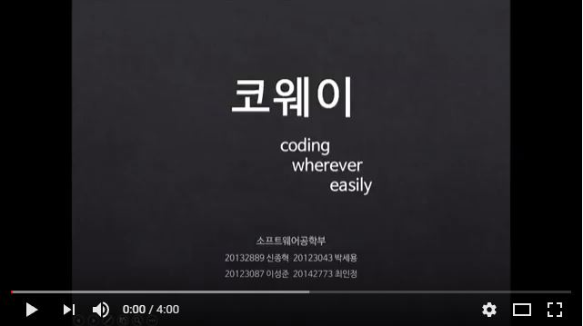

# Coway(코웨이, Coding Wherever Easily)

국민대학교 소프트웨어학부 캡스톤 프로젝트 2조

## 1. 프로젝트 소개

본 프로젝트는 **수기로 작성된 수도 코드를 사진으로 찍어 이를 텍스트 형태의 JAVA 코드로 변환**해 주는 것을 목표로 한다.<br>
컴퓨터를 사용하기 어려운 상황에 떠오르는 아이디어의 경우, 문법의 제약이 적은 간단한 수도 코드 형태로 알고리즘에 초점을 맞춰 아이디어를 정리하는 경우가 많다. <br>
하지만 이렇게 작성된 코드들의 대다수가 분실 혹은 문법 미 적용 등의 문제로 실제 코드를 작성할 때 활용되지 못하는 일회성 정보로 사라지기 쉽다. <br>
이런 문제점을 보완하기 위해 수도 코드로 작성된 코드를 JAVA 코드로 즉각 변환해주는 것으로 수기 코드의 활용 가능성을 높여 **코딩의 공간 및 시간적 제약을 감소**시키고자 한다.<br>

## 1.1 Abstract

Pseudo codes formats with few grammatical constraints are often used when analyzing sudden idea which focusing to the algorithm or under the circumstances that are difficult to use the compute.
However, most of the code written in this way is likely to disappear into one-off information that cannot be used when writing actual code due to problems such as loss or ungrammaticality. In order to solve this problem, we want to reduce the space and time constraints of coding by increasing the possibility of using the handwritten code by instantly converting the code written in the pseudo code into JAVA code. 


## 2. 소개 영상
[](https://www.youtube.com/watch?v=lW8TSarABVc)

## 3. 팀 소개

## 신종혁(팀장)


````
* 학번: 20132889
* 역할: 영상처리 및 텍스트 추출, 영상처리관련 모듈 개발, 팀장
* Email: shinjong9312@gmail.com
* Homepage: https://blog.naver.com/shinjong9312
````

## 박세용


````
* 학번: 20123043
* 역할: Interpreter 개발, Server 개발, 예약어 사전 구축 & 매칭, 공유 모듈 개발
* Email: marching0531@naver.com
* Homepage: http://parkgrounds.tistory.com/
````


## 이성준


````
* 학번: 20123087
* 역할: Interpreter 개발, Server 개발, 예약어 사전 구축 & 매칭
* Email: occidere@naver.com
* Homepage: https://blog.naver.com/occidere
````

## 최인정


````
* 학번:20142773
* 역할:Android App 개발, 공유 plug-in
* Email:starec6230@naver.com
````

### 4. 사용법

소스코드 제출 시 설치법 및 사용법 작성

**markdown example**
```markdown example
Syntax highlighted code block

# Header 1
## Header 2
### Header 3

- Bulleted
- List

1. Numbered
2. List

**Bold** and _Italic_ and `Code` text

[Link](url) and 
```
